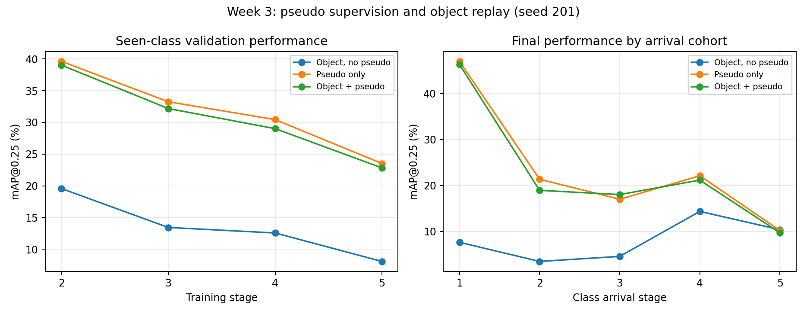

# Week 3 first experiment results

SUN RGB-D 40-class S5; same released stage-1 checkpoint and seed 201.

| Policy | Stage 2 | Stage 3 | Stage 4 | Stage 5 |
|---|---:|---:|---:|---:|
| Object, no pseudo | 0.1957 | 0.1344 | 0.1257 | 0.0808 |
| Pseudo only | 0.3962 | 0.3326 | 0.3044 | 0.2352 |
| Object + pseudo | 0.3902 | 0.3218 | 0.2902 | 0.2282 |

Pseudo supervision changes object replay by +0.1474 absolute mAP.
Object replay changes pseudo-only performance by -0.0070.

Both current runs exited successfully. The no-pseudo result is a historical matched control.
One seed does not establish significance. Later teachers and random augmentation streams
differ between policies. These are full policy comparisons.

Dose sweep and seed replication are complete; see WEEK_3_REPLICATION.md for the latest results.
No improved replay default is established yet.

