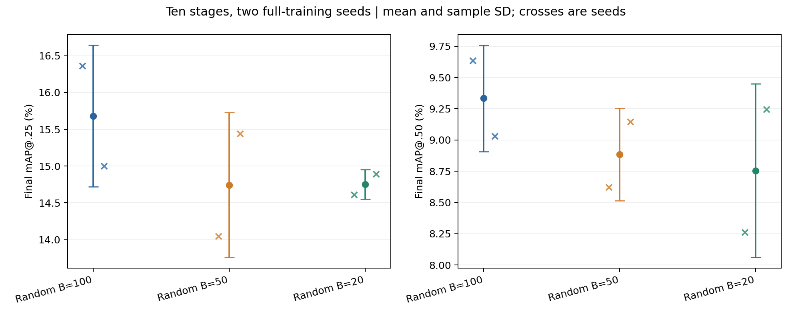

# Week 4 ten stage object memory budget study

Reducing the bank from **3,979 to 800 stored objects** saves **79.89% of objects**
and about **78.68% of bank bytes**, with a mean final mAP@0.25 loss of
**0.9295 percentage points**. This exceeds the provisional 0.5-point retention
tolerance. The experimental phase closed on October 1, 2026.

Six complete SUN RGB-D runs compare 100, 50 and 20 crops per class across two
full-training seeds. All use ten stages of four classes, object replay and
pseudo supervision. Unlike Week 3's replay-probability experiments, this study
reduces stored capacity while keeping the configured replay dose fixed.

| Crops per class | Final stored objects | Final AP25 mean ± sample SD | Final AP50 mean ± sample SD | Mean bank MiB |
|---|---:|---:|---:|---:|
| 100 | 3,979 | 15.6815 ± 0.964 | 9.3330 ± 0.426 | 327.95 |
| 50 | 2,000 | 14.7425 ± 0.986 | 8.8840 ± 0.371 | 166.83 |
| 20 | 800 | 14.7520 ± 0.202 | 8.7545 ± 0.695 | 69.93 |

AP values are percentages. SD describes only two runs and is not a confidence
interval. B=20's paired AP25 changes are −1.754 and −0.105 points; neither
reduced budget demonstrates retention within 0.5 points.

| Artifact | Contents |
|---|---|
| [Weekly findings](WEEK_4_WRAP_UP.md) | Question, protocol, results, interpretation and limitations |
| [Full analysis](WEEK_4_ANALYSIS.md) | Paired seeds, old/new AP, forgetting, storage and tolerance sensitivity |
| [Budget table](WEEK_4_BUDGET_COMPARISON.md) | Per-seed accuracy and actual object counts |
| [Selection diagnostic](WEEK_4_SELECTION_RECOVERY.md) | Failed full runs, population repair and four stage-2 continuations |
| [Class and storage diagnostics](WEEK_4_EXPLANATORY_DIAGNOSTICS.md) | Per-class losses and the byte cost of dense crops |
| [Protocol audit](WEEK_4_PROTOCOL_AUDIT.md) | Reference revisions, matching settings and remaining differences |
| [Reproduction notes](WEEK_4_TRAINING_PLAN.md) | Implementation overlay, commands, evidence and validation scope |

The alternative selector keeps crops with the largest point counts. Its full
ten-stage runs failed at bank population. After repair, a separate stage-2
diagnostic showed +0.870 and +1.080 AP25 points, but regenerated pseudo labels
also differed within each pair. This is suggestive early-stage evidence, not
an isolated selector effect or a final ten-stage result. An offline 800-object
dense bank occupies 251.70 MiB, 3.60 times random B=20's mean bytes.

The reference audit establishes the nominal budget and ten-stage split, but
does not identify a verified ten-stage object-memory score to reproduce.
This is a local extension and budget study with documented implementation
differences. The separate scene-memory result uses a different budget unit.

Compact results, original manifests, terminal markers and all 60 full-run
stage metric files are under `week4_runs/`. Checkpoints, datasets, raw training
logs, bank pickles and private reference source are excluded. Run the portable
numerical check with `python3 verify_week4_results.py`; it reads only the
published evidence and does not train a model.
